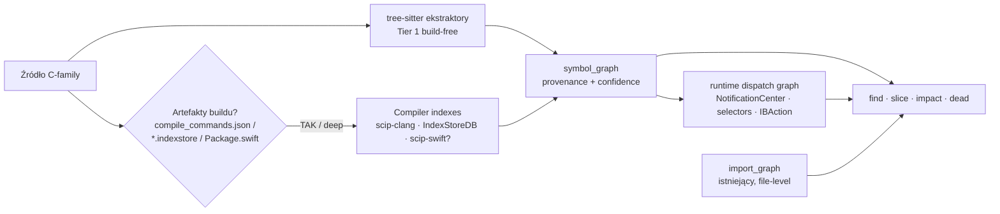

# Loctree C-Family Language Awareness — Synteza Researchu
## Swift · Objective-C · Objective-C++ · C · C++ — symbol & usage graph na froncie SOTA

> **Dokument syntezy** czterech niezależnych raportów triple-agent
> (`claude`, `codex`, `grok`, `agy/gemini`) + recon `junie`, dwa runy research
> (`rsch-224631-64525`, `rsch-231715-91111`) z 2026-05-28/29.
> Syntezę złożył operator-agent (klaudiusz). Duch: warstwowy atlas z
> `deep-loctree-research-report.md` (sześć prawd: repo/history/build/bundle/
> runtime/failure).
>
> **Status źródeł:** 4 raporty merytoryczne kompletne, 1 (`junie`) = recon-only
> (transcript bez finalnej treści). Rozbieżności i flagi-do-weryfikacji
> wyróżnione explicite. Żadnego greenwashu.

---

## 0. Executive decision (zero dalszego „co wybrać")

**Dodać `symbol_graph` jako równoległą warstwę obok istniejącego `import_graph`
— NIE naprawiać C-family przez import edges.** Silnik dwuwarstwowy:

1. **Tier 1 — baseline (default, build-free, cross-platform, Rust-native):**
   `tree-sitter` grammars (swift/c/cpp/objc) ekstraktują symbole (definicje +
   deklaracje + tanie heurystyczne references) i zasilają symbol_graph. To samo
   **natychmiast zabija obserwowany gap `find --where-symbol → 0`** bez wymogu
   buildu i bez macOS. Edge-e dostają `provenance/confidence = heuristic`.

2. **Tier 2 — deep mode (opt-in, gdy istnieją artefakty buildu):** import
   gotowego, precyzyjnego indeksu kompilatora. **C/C++ → SCIP via `scip-clang`**
   (Protobuf, parsowany natywnie w Rust przez `prost`, ZERO FFI).
   **Swift/ObjC → IndexStore via IndexStoreDB** (macOS, USR-based) jako ścieżka
   referencyjna; **SCIP `scip-swift` jako preferowany cel jeśli okaże się
   dojrzały** (patrz Flaga W-2). Edge-e dostają `provenance = scip_clang /
   indexstore / scip_swift`, `confidence = precise`.

**Wire format = SCIP-zgodne symbol IDs** (USR-style). loctree ma już `SymbolIdV2`
w `types.rs` — stabilizujemy go do SCIP descriptor format, żeby deep-mode import
mapował się 1:1. **Schema żyje w NOWYM module `symbols/`, nie w `types.rs`**
(hub o ~67-79 importerach — patrz §7).

**Co odrzucamy jako default:** `stack-graphs` (3 z 4 agentów przeciw jako
fundament — brak gotowych reguł C-family, oryginalne repo archived 2024-12);
zostaje jako *ewaluacja Phase 2* ze względu na świeży fork (Flaga W-1).
`Glean`/`Kythe` (infra-heavy, build-required, brak Rust) → tylko inspiracja
schematu edge. `clangd-as-LSP-subprocess` (łamie „scan once").

**Fazy:** 1 Symbols → 2 Usage edges → 3 Dispatch/events → 4 Cross-language
bridges. Phase 1 sam zabija „symbol find = 0".

---

## 1. Konsensus — na czym zgodziło się wszystkich 4 agentów

| # | Ustalenie | claude | codex | grok | agy |
|---|---|:--:|:--:|:--:|:--:|
| K1 | `symbol_graph` OBOK `import_graph` (nie naprawiać importów) | ✅ | ✅ | ✅ | ✅ |
| K2 | Dwuwarstwa: tree-sitter baseline + deep mode | ✅ | ✅ | ✅ | ✅ |
| K3 | `types.rs` to hub ~67-79 importerów → blast radius, zmiany addytywne | ✅ | ✅ | ✅ | ✅ |
| K4 | Provenance/authority/confidence per symbol+edge (heuristic vs precise) | ✅ | ✅ | ✅ | 🟡 |
| K5 | Model danych symboli **już częściowo istnieje** (`SymbolIdV2`, `FileAnalysis.symbol_usages`) | ✅ | 🟡 | ✅ | — |
| K6 | 4 fazy: Symbols → Usage → Dispatch/events → Cross-lang bridges | ✅ | ✅ | ✅ | ✅ |
| K7 | Periphery = wzorzec Swift (build index → graph declarations/refs) | ✅ | ✅ | ✅ | — |
| K8 | macOS-only IndexStore = ryzyko Linux CI → tree-sitter ratuje cross-platform | ✅ | ✅ | ✅ | ✅ |
| K9 | SCIP = wire format / standard wymiany (Protobuf, prost-parsable) | ✅ | ✅ | ✅ | ✅ |
| K10 | Dogfood: Pensieve (Swift) + `legacy/MarkdownEditor` (ObjC, w **pensieve**) | ✅ | ✅ | ✅ | ✅ |
| K11 | arXiv 2211.01224 (Stack graphs) = wspólny bedrock cytat | ✅ | ✅ | ✅ | ✅ |
| K12 | Diagnoza: import=0 częściowo semantyka; symbol-find=0 realny gap | ✅ | ✅ | ✅ | ✅ |

**Wniosek diagnostyczny (4/4 zgoda):** gap symboli jest realny i
**architektonicznie tani** — model danych częściowo stoi, brakuje warstwy
parsowania + rezolucji. Import-graph=0 dla Swifta to faktycznie semantyka
(intra-module brak `import`), więc **symbol-level graph jest właściwym kształtem
feature, nie import-level.**

---

## 2. Rozbieżności i rozstrzygnięcia operatora

### R1 — stack-graphs: primary czy odrzucony?

| Agent | Stanowisko |
|---|---|
| claude | **Odrzuć jako default** — brak reguł C-family (tylko JS/TS/Py/Java), C++ ODR/overload fundamentalnie trudny dla scope-graph. Opcja tylko Swift. |
| codex | **Research module only** — oryginalne repo `github/stack-graphs` oznaczone „no longer supported/updated". |
| grok | **PRIMARY** — ale wnosi świeży fakt: aktywny fork `metaslang_stack_graphs` (Nomic/slang, luty 2026). Argument: jedyne build-free *precyzyjne* name-resolution (nie heurystyka). |
| agy | Landscape „Słaba (brak C-family preprocesora)" → nie primary. |

**Rozstrzygnięcie:** 3 z 4 przeciw stack-graphs jako fundament. Grok osamotniony,
ale jego fakt (fork luty 2026) jest najświeższy i wart weryfikacji. **Decyzja:
tree-sitter to baseline Tier 1; stack-graphs NIE blokuje Phase 1-2, ale wchodzi
jako EWALUACJA w Phase 2** — sprawdzić `metaslang_stack_graphs` (Flaga W-1):
jeśli fork żyje i ma C-family TSG rules, daje precyzyjniejszą rezolucję niż
heurystyka tree-sitter. Jeśli nie — zostajemy z tree-sitter + deep mode.

### R2 — deep mode Swift/ObjC: IndexStoreDB (FFI) vs SCIP scip-swift (subprocess)?

| Agent | Preferencja deep Swift/ObjC |
|---|---|
| claude | IndexStore via IndexStoreDB (FFI/subprocess); SCIP scip-clang dla C/C++. „No Swift SCIP indexer found". |
| codex | IndexStoreDB (Periphery shape) dla Swift/ObjC; SCIP/clang dla C/C++. |
| grok | IndexStoreDB (macOS) LUB scip-clang; scip-swift = „Community (cog-swift)". |
| agy | **Odrzuć IndexStoreDB FFI (cross-platform koszmar)** → SCIP `scip-clang`+`scip-swift` wszędzie, czysto przez `prost`, zero FFI. |

**Rozstrzygnięcie:** to jest **najważniejsza techniczna rozbieżność**. Sednem
jest: **czy `scip-swift` realnie istnieje i jest dojrzały?** Claude mówi „nie
znalazłem", grok „community/cog-swift", agy traktuje jako pewnik. **Decyzja
kierunkowa: SCIP-as-wire-format to cel docelowy** (prost, zero FFI, cross-platform,
zgodne z doktryną AICX „cli shellout brzydkie" — ale subprocess-do-indexera ≠
subprocess-per-query, to akceptowalne jak wywołanie kompilatora). **JEDNAK** do
czasu weryfikacji dojrzałości `scip-swift` (Flaga W-2), **IndexStoreDB pozostaje
ścieżką referencyjną dla Swift/ObjC na macOS** (Periphery to udowadnia w
produkcji). Architektura `SymbolEngine` trait izoluje wybór — można zacząć od
IndexStore i podmienić na scip-swift gdy dojrzeje. Dla **C/C++ konsensus jest
jednoznaczny: scip-clang** (Clang 21, Protobuf, prost).

### R3 — frontier papers: różny poziom pewności (cutoffflu watch)

| Agent | Papers | Ryzyko |
|---|---|---|
| claude | 7: 2211.01224 + 2408.03910, 2410.14684, 2504.10046, 2505.16901, 2509.25257, 2511.16005 | secondary do weryfikacji URL |
| codex | 2211.01224 + **2603.27277, 2603.24837** (luty 2026) + 2505.12118 + aclanthology NAACL 2025 | **2603.* = HIGH RISK halucynacji** (data świeża, niesprawdzone) |
| grok | tylko 2211.01224 jako pewny; reszta „nie znalazłem verifiable" | konserwatywny, najbezpieczniejszy |
| agy | 2211.01224 + opisowe (SCIP docs, Joern/CPG) | OK |

**Rozstrzygnięcie:** **arXiv 2211.01224 (Stack graphs, Creager & van Antwerpen)
= jedyny bedrock cytowany przez 4/4** — pewny. Claude'owe 2408+ = secondary,
**oznaczone „weryfikować URL przed cytowaniem w docs".** **Codex'owe `2603.*`
(luty 2026) = oznaczone HIGH-RISK — wymagają twardej weryfikacji arXiv ID przed
jakimkolwiek użyciem** (CLAUDE.md cutoffflu guard: świeże ID z przyszłej daty to
klasyczny wektor halucynacji). Grok'owa konserwatywność (tylko to co sprawdzone)
jest tu wzorem dyscypliny. **Nie wciągamy niesprawdzonych ID do implementacji.**

### R4 — gdzie w kodzie: types.rs vs nowy symbols/ module

| Agent | Lokalizacja schematu |
|---|---|
| claude | `analyzer/cfamily/` + `semantic/swift+objc` + `index_import/` + pola w `types.rs` |
| codex | **NOWY `symbols/` module** (NIE types.rs) + `analyzer/c_family_syntax/` + `analyzer/{indexstore,scip,clang}/` + `semantic/c_family.rs` |
| grok | `analyzer/c_family.rs` + `semantic/symbol_graph.rs` + struct w `types.rs`/`snapshot.rs` |
| agy | `analyzer/scip.rs` + `analyzer/tree_sitter_cfamily.rs` + `semantic/symbol_resolution.rs` |

**Rozstrzygnięcie:** **przyjmujemy codex shape** — **nowy `symbols/` module zamiast
pchać `SymbolGraph` do `types.rs`**. Powód: `types.rs` ma ~67-79 importerów
(blast radius); dodanie tam dużego schematu to wide-impact change. Nowy moduł
`symbols/` z wąskim re-exportem minimalizuje fan-in. `analyzer/` dla ekstrakcji
(tree-sitter), `semantic/` dla dispatch/runtime (events), osobny `index_import/`
(albo `analyzer/{scip,indexstore}/`) dla Tier 2, feature-gated. Konsensus
3/4: **definicje/references → `analyzer`+`symbols`; runtime dispatch (events) →
`semantic`** (bo `semantic/` już modeluje Tauri commands/events, Make).

---

## 3. Landscape table (zmerge'owana, 4 raporty)

Legenda: ✅ pełne · 🟡 częściowe/heurystyka · ❌ brak · ⚙️ wymaga buildu

| Silnik | C | C++ | ObjC | Swift | Build-free? | Rust-native? | Usage graph? | Licencja | Werdykt syntezy |
|---|:--:|:--:|:--:|:--:|:--:|:--:|:--:|---|---|
| **tree-sitter + grammars** | ✅ | ✅ | 🟡 | ✅ | ✅ | ✅ crate | ❌ resolve-free | MIT | **Tier 1 default** (baseline, wszyscy zgodni) |
| **scip-clang** (SCIP) | ✅ | ✅+CUDA | 🟡 | ❌ | ⚙️ `compile_commands.json` | ✅ prost decode | ✅ precise | Apache-2.0 | **Tier 2 C/C++** (konsensus 4/4) |
| **IndexStoreDB** (sourcekitd) | ✅ | ✅ | ✅ | ✅ | ⚙️ index-while-building | ❌ FFI/subprocess | ✅ precise (USR/LMDB) | Apache-2.0 | **Tier 2 Swift/ObjC macOS** (ref path, Periphery proof) |
| **scip-swift** (cog-swift?) | ❌ | ❌ | 🟡 | ✅? | ⚙️ | ✅ prost | ✅? | Apache-2.0 | **Cel docelowy Swift jeśli dojrzały — FLAGA W-2** |
| **stack-graphs** (+ fork) | ❌ | ❌ | ❌ | 🟡 | ✅ | ✅ crate | ✅ gdy reguły | MIT/Apache | **Ewaluacja Phase 2** — fork metaslang FLAGA W-1 |
| **clangd / libclang** | ✅ | ✅ | ✅ | ❌ | ⚙️ | 🟡 `clang-sys` | ✅ precise | Apache-2.0 | Alternatywa C/C++ jeśli SCIP za ciężki |
| **Kythe** | ✅ | ✅ | 🟡 | ❌ | ⚙️ kzip | ❌ | ✅ schema | Apache-2.0 | Inspiracja schematu edge, nie runtime |
| **Glean** (Meta) | ✅ | ✅ | 🟡 | ❌ | ⚙️ | ❌ Haskell/Angle | ✅ | BSD | Lekcja storage (immutable facts), za ciężki |
| **Joern / CPG** | ✅ | ✅ | 🟡 | ❌ | 🟡 | ❌ JVM | ✅ dataflow | Apache-2.0 | Idea CPG/dataflow, za ciężki jako default |
| **CodeQL** | ✅ | ✅ | ❌ ObjC unsup. | 🟡 macOS | ⚙️ | ❌ | 🟡 security | GitHub terms | Konkurent security, nie xref engine |
| **SCIP** (protokół) | — | — | — | — | n/d | ✅ prost | wire format | Apache-2.0 | **Wybrany wire format całości** |

**Czytanie tabeli (konsensus):** żaden pojedynczy silnik nie daje (build-free) ∧
(Rust-native) ∧ (precise usage graph) ∧ (cała rodzina C). Dlatego **dwuwarstwa,
nie jeden pick** — twardy wniosek z osi krytycznej RQ2 u wszystkich 4 agentów.

---

## 4. Graph model proposal — `symbol_graph` obok `import_graph`

### 4.1 Schema (synteza codex + claude + grok + agy)

```rust
// NOWY module: loctree-rs/src/symbols/mod.rs  (NIE types.rs)
pub struct SymbolGraph {
    pub schema_version: String,            // "loctree.symbol_graph.v1"
    pub engines: Vec<SymbolEngineRun>,     // które silniki zasiliły graf
    pub symbols: Vec<SymbolNode>,
    pub occurrences: Vec<SymbolOccurrence>,
    pub edges: Vec<SymbolEdge>,
    pub file_projection: Vec<FileSymbolSummary>,  // dla slice(file)
}

pub struct SymbolNode {
    pub id: SymbolId,                      // SCIP-style USR descriptor
    pub language: LanguageId,              // C | Cpp | ObjC | ObjCpp | Swift
    pub kind: SymbolKind,                  // Type|Protocol|Func|Method|Property|
                                           // Var|Macro|Enum|Selector|Module|...
    pub name: String,
    pub qualified_name: Option<String>,
    pub module: Option<String>,            // Swift module / C++ namespace / ObjC umbrella
    pub usr: Option<String>,
    pub file: Option<PathBuf>,
    pub range: Option<TextRange>,
    pub signature: Option<String>,
    pub visibility: Option<Visibility>,
    pub provenance: SymbolProvenance,      // tree_sitter|indexstore|scip_clang|
                                           // scip_swift|clangd|heuristic
}

pub struct SymbolOccurrence {
    pub symbol_id: SymbolId,
    pub file: PathBuf,
    pub range: TextRange,
    pub role: OccurrenceRole,              // Definition | Reference | Call | ...
    pub confidence: Confidence,            // Heuristic | Precise
    pub engine: EngineId,
}

pub enum SymbolEdgeKind {
    // uniwersalne
    Defines, Declares, References, Calls,
    // OO / protokoły
    Overrides, Conforms, Implements, Inherits,
    // preprocesor / moduły
    Includes, ImportsModule,
    // C++
    Instantiates, MacroExpands,
    // ObjC
    SelectorMessage,
    // runtime dispatch / events
    NotificationEmit, NotificationObserve,
    IBOutletBinding, IBActionBinding,
    // cross-language
    Bridges,
}
```

**Kluczowa decyzja modelu (konsensus claude+codex+grok):** każdy node/edge ma
`provenance` + `confidence`. Zgodne z loctree-ową dyscypliną „authority labels"
w context packu (`LoctreeDerived` vs `RepoVerified`). **Agent widzi, czy krawędź
jest heurystyczna (tree-sitter) czy precyzyjna (index-import) — i nie traktuje
heurystyki jako prawdy.** Deep mode NIGDY nie udaje precyzji której nie ma.

### 4.2 ID rule (codex)

Compiler engines (Tier 2) → stabilne USR/SCIP symbols. Build-free fallback
(Tier 1) → `language + normalized_scope + file + syntax_node_range_hash`,
jawnie oznaczone niższą confidence.

### 4.3 Jednostka analizy per-język (claude)

| Język | Jednostka | „Import" | Cross-unit binding |
|---|---|---|---|
| C | translation unit | `#include` (preprocesor) | linker symbol |
| C++ | translation unit | `#include` | ODR symbol, template instantiation |
| ObjC | `@interface`/`@implementation` | `#import` (idempotent) | `@selector` late-binding, categories |
| ObjC++ | TU + ObjC | `#import`/`#include` | obie ścieżki naraz (.mm = dual-mode) |
| Swift | **moduł** (pliki widzą się bez `import`) | `import Module` | protocol conformance, extensions, USR |

### 4.4 Jak komendy loctree się komponują (codex)

- `find X --where-symbol` → query `symbol_graph.symbols`; fallback do tag/path.
- `slice file` → import deps/consumers **+** symbole zdefiniowane w pliku **+**
  zewnętrzne occurrences referujące te symbol IDs.
- `impact symbol` → blast radius po `References|Calls|Overrides|Conforms|
  Instantiates|SelectorMessage|NotificationObserve`.
- `dead` → compiler-confidence reachability najpierw; build-free deklaracje
  tylko jako low-confidence hints.
- `follow events` → adaptery językowe emitują `NotificationEmit/Observe`,
  `SelectorMessage`, `IBActionBinding` do jednego runtime grafu (zamiast
  obecnego `mermaid.min.js` JS-emit).

---

## 5. Architektura przepływu (mermaid, synteza codex + claude)



`import_graph` = topologia plików (zostaje, backward-compat dla 67-79 importerów
`types.rs`). `symbol_graph` = topologia semantyczna. Komendy komponują oba.

---

## 6. C-family specifics — per-język edge types (synteza 4 raportów)

| Język | Konstrukty | Edge (statycznie łapalne) | Limit (tylko deep-mode) |
|---|---|---|---|
| **C** | funkcje, structs, typedef, makra, globals | `Defines`, `Declares`, `Calls`, `References`, `Includes` | makra preprocesora (TS widzi tekst, nie ekspansję) |
| **C++** | templates, namespaces, overloads, virtual, ODR, concepts | + `Inherits`, `Overrides`, `Instantiates` | overload resolution / ADL / template instantiation = **deep-mode** (clangd background-index) |
| **ObjC** | `@interface`/`@implementation`/`@protocol`/`@property`, categories, ivars | + `Conforms`, `SelectorMessage`, `Includes`, `.h↔.m` declare/implement | late-binding `performSelector:`, KVO, runtime categories — niepełne statycznie |
| **ObjC++** | ObjC + C++ (`.mm`) | suma obu, `Bridges` | potrzebuje Clang truth bardziej niż TS (dwa scope naraz) |
| **Swift** | protocols, extensions, generics, `@objc`, property wrappers, result builders, actors | `Conforms`, `Overrides`, `Extends`, intra-module `References` bez `import` | dynamic `@objc` bridge, KeyPath, Swift Macros — heurystycznie |

**Dispatch / event bridges (→ `semantic/`):**
- **Swift `NotificationCenter`:** `.post(name:)` → `NotificationEmit`;
  `addObserver`/`.publisher(for:)` → `NotificationObserve`. Pary po nazwie
  (`Notification.Name` stałe, np. `.vcDocumentChanged`) — **literal/static tylko**.
- **ObjC `NSNotificationCenter`, target-action** (`addTarget:action:`),
  **`@selector(...)` → `SelectorMessage`** (heurystyka po nazwie selektora).
- **`IBOutlet`/`IBAction`** → wymaga **co-analizy storyboard/XIB XML** (osobny
  parser), realistycznie **Phase 4**. Konsensus: emit z `confidence` + flagą,
  bo string-matching jest noisy.

**Cross-language (Phase 4):** Swift↔ObjC przez generated `*-Swift.h` + `@objc`
USR linking (IndexStore robi to natywnie; tree-sitter/stack-graphs potrzebują
bridging-header rules). ObjC++ `.mm` jako most ObjC message ↔ C++ method.

---

## 7. Integration blueprint (codex shape, konsensus 3/4)

```
loctree-rs/src/
├── symbols/                    # NOWY — rdzeń schematu (NIE types.rs!)
│   ├── mod.rs                  #   SymbolGraph, SymbolNode/Edge, IDs, provenance
│   └── query.rs                #   lookup, references, callers, blast-radius helpers
├── analyzer/
│   ├── c_family_syntax/        # NOWY — Tier 1 tree-sitter (swift/c/cpp/objc)
│   │   ├── mod.rs              #   dispatch po rozszerzeniu
│   │   ├── symbols.rs          #   @interface/@implementation, class/struct/func
│   │   ├── includes.rs         #   #include / #import → Includes edges
│   │   └── usages.rs           #   references / calls / @selector → occurrences
│   ├── scip/                   # NOWY — Tier 2 import index.scip (prost decode)
│   ├── indexstore/             # NOWY — Tier 2 Swift/ObjC FFI/subprocess (macOS)
│   ├── clang/                  # OPCJ. — libclang/clangd bridge gdy compile DB
│   ├── classify.rs             # ROZSZERZ — rozpoznaj .swift/.m/.mm/.c/.cpp/.h
│   ├── runner.rs               # ROZSZERZ — insertion point: istnieje już
│   │                           #   `default_analyzer_exts_includes_swift()` stub
│   │                           #   + haki comments (grok finding)
│   └── root_scan.rs            # ROZSZERZ — Swift/C-family ext registration
├── semantic/
│   ├── c_family.rs             # NOWY — NotificationCenter/NSNotificationCenter,
│   │                           #   @selector, target-action, IBOutlet/IBAction
│   └── mod.rs                  # ROZSZERZ — rejestracja dispatch (wzór tauri.rs)
├── snapshot.rs                 # ROZSZERZ — symbol_graph jako OPCJONALNA sekcja
│                               #   (#[serde(default)], stare snapshoty nie pękają)
└── types.rs                    # MINIMALNIE — wąski re-export z symbols/, NIE
                                #   pełny schemat (hub ~67-79 importerów!)
```

**Dlaczego nie wszystko w `semantic/`?** (codex) `semantic/` modeluje runtime
idioms i dispatch. Ekstrakcja symboli to niższa warstwa, bliżej analyzer/snapshot.
C-family **runtime bridges** (events) należą do `semantic/`, ale **definicje/
references** do `symbols/` + `analyzer`.

**Insertion points (grok recon, zweryfikowane w loctree-suite):**
`runner.rs` ma już `default_analyzer_exts_includes_swift()` stub + haki comments;
`classify.rs:82` rozpoznaje języki; `for_ai.rs:91` wspomina „markdown-editor-mac-objc".
To są dokładne punkty zaczepienia — Swift nie jest zielonym polem, są ślady prób.

**Cargo / zależności:**
- `tree-sitter` + grammars (swift `alex-pinkus`, objc `tree-sitter-grammars`,
  c/cpp oficjalne) — tree-sitter już w workspace (Plan 19 Stage 1).
- `prost` + `scip.proto` (z repo Sourcegraph) dla SCIP decode.
- Tier 2 feature-gated: `#[cfg(feature = "deep-index")]` — Linux build bez
  SourceKit nie waży.
- `SymbolEngine` trait izoluje silniki — IndexStore/scip-swift wymienne.

---

## 8. Phased plan (zunifikowany, 4/4 zgoda na kształt)

| Faza | Zakres | Silnik | Acceptance gate (dogfood) |
|---|---|---|---|
| **Phase 0 — Schema + fixtures** | `symbol_graph` opcjonalna sekcja snapshot + JSON round-trip testy; fixtures Swift (Pensieve) + ObjC (MarkdownEditor) do `loctree-rs/tests/fixtures/cfamily/` | — | stare snapshoty nie pękają; symbol_graph serializuje się |
| **Phase 1 — Symbols (build-free)** | per-file `ExportSymbol`/`LocalSymbol` dla Swift+C/C++/ObjC; `find --where-symbol` → symbol_graph | tree-sitter | `find WorkspaceSubstrate --where-symbol` > 0 na Pensieve; ObjC klasy/protokoły w MarkdownEditor > 0 |
| **Phase 2 — Usage edges + deep mode** | cross-file `References/Calls/Conforms/Overrides`; `slice`/`impact` na symbolach. **+ ewaluacja stack-graphs fork (W-1).** Deep: IndexStore (Swift/ObjC macOS) + scip-clang (C/C++) | tree-sitter + resolver + index_import | `slice DocumentStore.swift` > 0 consumers (z `WorkspaceSubstrateTests`); `impact` blast-radius ≠ 0 |
| **Phase 3 — Dispatch/events** | `semantic/c_family.rs`: NotificationCenter/NSNotificationCenter/@selector/target-action | semantic + idiom tables | `follow events` zwraca Swift `.vcDocumentChanged`, NIE `mermaid.min.js` |
| **Phase 4 — Cross-language bridges** | ObjC↔Swift (`@objc`, `*-Swift.h`), ObjC++ `.mm`, storyboard/XIB IBOutlet/IBAction XML co-analysis | tree-sitter + XML + IndexStore | impact bridged `@objc` method/selektora przechodzi granicę języka |

Każda faza niezależnie wartościowa: **Phase 1 sam zabija „symbol find = 0".**

**Verification gates (każda faza):** `make test`, `cargo clippy -- -D warnings`,
loctree-mcp context + find/slice na nowych symbolach, golden tests dla
`symbol_graph.v1`.

---

## 9. Frontier papers (z flagami pewności — cutoffflu guard)

| Praca | ID / URL | Pewność | Relevancja |
|---|---|:--:|---|
| **Stack graphs: Name resolution at scale** (Creager, van Antwerpen) | [arXiv:2211.01224](https://arxiv.org/abs/2211.01224) | ✅ **4/4 bedrock** | Fundament name-resolution-as-graph; potwierdza że scope-graph nie obejmuje C++ ODR/overload |
| CodexGraph | [arXiv:2408.03910](https://arxiv.org/abs/2408.03910) / [NAACL 2025](https://aclanthology.org/2025.naacl-long.7/) | 🟡 weryfikować | LLM↔repo przez code graph DB — uzasadnia agent-first usage graph |
| RepoGraph (ICLR 2025) | [arXiv:2410.14684](https://arxiv.org/abs/2410.14684) | 🟡 weryfikować | Repo-level graph: intra-file + inter-file — kształt symbol_graph |
| Do Code LLMs Do Static Analysis? | [arXiv:2505.12118](https://arxiv.org/abs/2505.12118) | 🟡 weryfikować | Argument ZA symbol graphs vs prompt-only — LLM słaby na callgraph/AST |
| GraphCodeAgent / CGM / RANGER / InfCode-C++ | 2504.10046, 2505.16901, 2509.25257, 2511.16005 | 🟡 weryfikować URL | claude-only; secondary, sprawdzić przed cytowaniem |
| **`2603.27277`, `2603.24837`** (codex) | — | 🔴 **HIGH-RISK** | data luty 2026, **NIESPRAWDZONE — twarda weryfikacja arXiv ID przed użyciem** |

**Tooling docs (sprawdzone przez agentów, 2026-05-28):**
[sourcekit-lsp](https://github.com/swiftlang/sourcekit-lsp) ·
[indexstore-db](https://github.com/swiftlang/indexstore-db) ·
[scip-clang](https://github.com/sourcegraph/scip-clang) ·
[scip proto](https://github.com/sourcegraph/scip) ·
[scip-clang blog](https://sourcegraph.com/blog/announcing-scip-clang) ·
[clangd indexing](https://clangd.llvm.org/design/indexing) ·
[tree-sitter-swift (alex-pinkus)](https://github.com/alex-pinkus/tree-sitter-swift) ·
[tree-sitter-objc](https://github.com/tree-sitter-grammars/tree-sitter-objc) ·
[Periphery](https://github.com/peripheryapp/periphery) ·
[Kythe schema](https://kythe.io/docs/schema/) ·
[Glean](https://glean.software/docs/introduction/) ·
[stack-graphs (archived)](https://github.com/github/stack-graphs)

> **Cutoffflu guard:** wszystkie ID z ✅/🟡 pochodzą z wyszukiwarek w sesjach
> research (maj 2026). ID z 🔴 (`2603.*`) wymagają twardej weryfikacji — NIE
> wciągamy do implementacji bez sprawdzenia. Grok'owa konserwatywność (tylko
> 2211.01224 jako pewny) to wzór dyscypliny.

---

## 10. Pozycjonowanie vs konkurencja (konsensus)

| Narzędzie | Co robi | Czego NIE robi (nisza loctree) |
|---|---|---|
| clangd / SourceKit-LSP | go-to-def, find-refs (LSP per-zapytanie) | brak holograficznego `slice`, brak blast-radius `impact`, build-required |
| Sourcegraph (SCIP) | code-nav server-side | brak agent-first context pack, brak „co pęknie po edycji" jako jeden call |
| Glean / Kythe | indeks at scale (Meta/Google infra) | infra-heavy, nie zero-config, nie Rust, nie agent-pack |
| CodeQL / Joern | security / dataflow | nie struktura/usage dla agenta; ObjC unsupported (CodeQL) |
| Periphery | Swift dead-code (IndexStoreDB) | tylko Swift, tylko dead-code; ale **wzorzec traversal** dla nas |

**Gdzie loctree wygrywa (4/4):** zero-config „scan once", agent-first context
pack z authority labels, `impact` blast-radius i `slice` jako pojedyncze calle.
Dodanie C-family symbol graphu **rozszerza tę niszę na rodzinę C, nie kopiuje
clangd.** Winning move: znormalizować compiler/source indexy do istniejących
komend loctree, nie zbudować kolejnego LSP.

---

## 11. Risk register (zmerge'owany)

| Ryzyko | Waga | Mitygacja |
|---|---|---|
| SourceKit/IndexStore głównie macOS | **Wysoka** | Tier 1 (tree-sitter) default cross-platform; deep-mode feature-gated; `loct doctor c-family` wyjaśnia braki na Linux |
| Build-required deep mode vs „scan once" | Średnia | Deep opt-in/opportunistic; cache per snapshot/build fingerprint; graceful degrade do Tier 1 |
| C++ ODR/overload/template = heurystyka zawodzi | **Wysoka** | Edge-e Tier 1 = `confidence: Heuristic`; precyzja tylko deep-mode. **Nie udajemy precyzji.** |
| **stack-graphs maintenance** (oryginał archived 2024-12) | **Wysoka** | NIE fundament; tree-sitter baseline; fork `metaslang` tylko ewaluacja (W-1) |
| **scip-swift dojrzałość niepewna** | **Wysoka** | IndexStore jako ref path macOS; `SymbolEngine` trait pozwala podmienić (W-2) |
| ObjC tree-sitter grammar słabszy | Średnia | Phase 1 ObjC = best-effort; deep-mode (clang/IndexStore) precyzyjny |
| `types.rs` ~67-79 importer hub | Średnia | Schemat w NOWYM `symbols/` module; wąski re-export; małe PR-y; `loct impact` przed każdą zmianą |
| Storyboard/IBAction XML noisy | Średnia | `confidence` + flaga; transparentny string-matching; Phase 4 |
| Codex arXiv `2603.*` halucynacja | Średnia | Oznaczone HIGH-RISK; twarda weryfikacja przed cytowaniem |
| Subprocess shellout (estetyka AICX) | Niska | Subprocess-do-indexera ≠ per-query; `SymbolEngine` trait → przyszłe native adaptery |

---

## 12. Dogfood validation (acceptance, konsensus)

**Konflikt z planem (claude+codex zgodni):** plan zakładał `legacy/MarkdownEditor`
„w repo". Recon: ObjC fixture jest w **pensieve/legacy** (36 `.h/.m` +
`Main.storyboard`), **nie w loctree-suite** (tam zero `.swift/.m/.mm`; jedyne
C-family to vendored keytar `*.cc`). **Plan naprawczy:** skopiować mini-fixtures
do `loctree-rs/tests/fixtures/cfamily/`.

**Swift (Pensieve `feat/pensieve-mvp3-machete2@2b81439`):**
```bash
loct find WorkspaceSubstrate --where-symbol   # cel: > 0 (dziś 0)
loct slice Pensieve/Sources/Pensieve/Storage/DocumentStore.swift  # cel: > 0 consumers
loct follow events                            # cel: .vcDocumentChanged, nie mermaid.min.js
```
Acceptance: `WorkspaceSubstrate` znaleziony z definition range + references z
`WorkspaceSubstrateTests.swift`; `DocumentStore.swift` ma symbol consumers mimo
0 import consumers; NotificationCenter events nie zagłuszone JS asset noise.

**ObjC (MarkdownEditor `pensieve/legacy`):**
```bash
loct find EditorViewController --where-symbol  # cel: > 0
loct slice legacy/MarkdownEditor/.../EditorViewController.m
loct follow events                              # storyboard actions ↔ ObjC methods
```
Acceptance: `.h`↔`.m` klasyfikowane jako ObjC i połączone; storyboard
actions/outlets + selector edges widoczne; ObjC pliki uczestniczą w projekcjach
mimo słabego import-graphu.

**C/C++:** dedykowany mini-fixture z templates/namespaces (keytar vendored jest
wykluczony ze skanu) dla testu deep-mode (scip-clang + compile_commands.json).

---

## 13. Flagi-do-weryfikacji przed implementacją

| Flaga | Pytanie | Dlaczego krytyczne |
|---|---|---|
| **W-1** | Czy `metaslang_stack_graphs` (Nomic/slang, luty 2026) żyje i ma C-family TSG rules? | Grok promuje jako primary; claude/codex odrzucają. Rozstrzyga R1. Jeśli żywy z regułami → precyzja build-free; jeśli nie → tree-sitter heurystyka. |
| **W-2** | Czy `scip-swift` (cog-swift?) istnieje i jest produkcyjnie dojrzały? | Rozstrzyga R2 (SCIP-everywhere vs IndexStore-macOS). Claude „nie znalazłem", agy traktuje jak pewnik. Decyduje czy unikamy FFI. |
| **W-3** | Weryfikacja arXiv `2603.27277` / `2603.24837` (codex) | HIGH-RISK cutoffflu. Nie cytować w docs bez potwierdzenia. |
| **W-4** | Dokładna liczba importerów `types.rs` na target-branchu | claude 67 / codex 68 / grok 79 — różne snapshoty. Potrzebne dla oceny blast radius przed PR. |
| **W-5** | tree-sitter-objc grammar maturity (utrzymanie, pokrycie categories/selektorów) | Wpływa na jakość Phase 1 ObjC. |

---

## 14. Decyzja końcowa (dla operatora — zero dalszego „co wybrać")

- **Silnik:** tree-sitter (Tier 1, default, build-free, cross-platform) +
  scip-clang (Tier 2 C/C++) + IndexStoreDB→scip-swift (Tier 2 Swift/ObjC, macOS).
  stack-graphs = ewaluacja Phase 2 (fork W-1). Glean/Kythe = inspiracja schematu.
- **Graf model:** `symbol_graph` obok `import_graph`, SCIP-zgodne IDs,
  per-node/edge `provenance` + `confidence` (heuristic vs precise).
- **Gdzie w kodzie:** NOWY `symbols/` module (NIE types.rs hub) +
  `analyzer/c_family_syntax/` (Tier 1) + `analyzer/{scip,indexstore}/` (Tier 2,
  feature-gated) + `semantic/c_family.rs` (dispatch). Insertion points już
  istnieją (`runner.rs` swift stub + haki).
- **Fazy:** 0 Schema+fixtures → 1 Symbols (zabija „find=0") → 2 Usage+deep →
  3 Dispatch/events → 4 Cross-language bridges.
- **Przed startem:** rozstrzygnij flagi W-1 (stack-graphs fork) i W-2 (scip-swift)
  — to jedyne dwa otwarte wybory architektoniczne. Reszta jest zdecydowana.

---

### Załącznik: pokrycie RQ (agregat 4 raportów)

| RQ | Status | Kluczowy wniosek |
|---|:--:|---|
| RQ1 Silnik SOTA | ✅ | tree-sitter baseline + index-import deep; stack-graphs ≠ C-family-ready (3/4) |
| RQ2 Build-free vs required | ✅ | dwuwarstwa; default build-free, deep czyta gotowy indeks |
| RQ3 Graph model | ✅ | symbol_graph obok import_graph, SCIP IDs, provenance/confidence |
| RQ4 Rust integration | ✅ | tree-sitter crate natywnie; SCIP via prost (zero FFI); IndexStore via FFI/subprocess macOS |
| RQ5 Frontier papers | 🟡 | 2211.01224 bedrock (4/4); reszta do weryfikacji; 2603.* HIGH-RISK |
| RQ6 Pozycjonowanie | ✅ | loctree wygrywa zero-config agent-pack + impact/slice; nie kopiuje clangd |

---

**Źródła syntezy:**
`rsch-224631-64525` (claude `d53a0427`, codex `019e720e`, agy) ·
`rsch-231715-91111` (agy, junie recon-only, grok) ·
loctree-suite `fix/the-truth-of-findings` · Pensieve `feat/pensieve-mvp3-machete2@2b81439`

_𝚅𝚒𝚋𝚎𝚌𝚛𝚊𝚏𝚝𝚎𝚍. with AI Agents by Vetcoders (c)2024-2026 The LibraxisAI Team_
